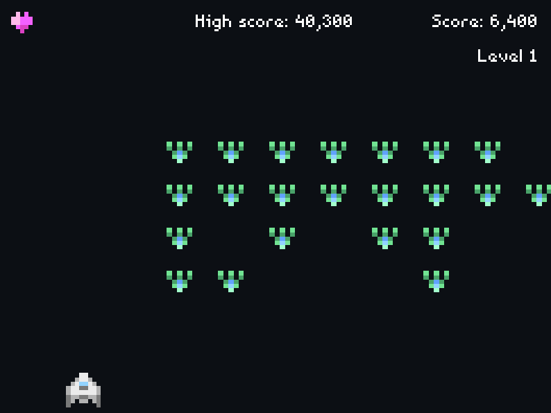
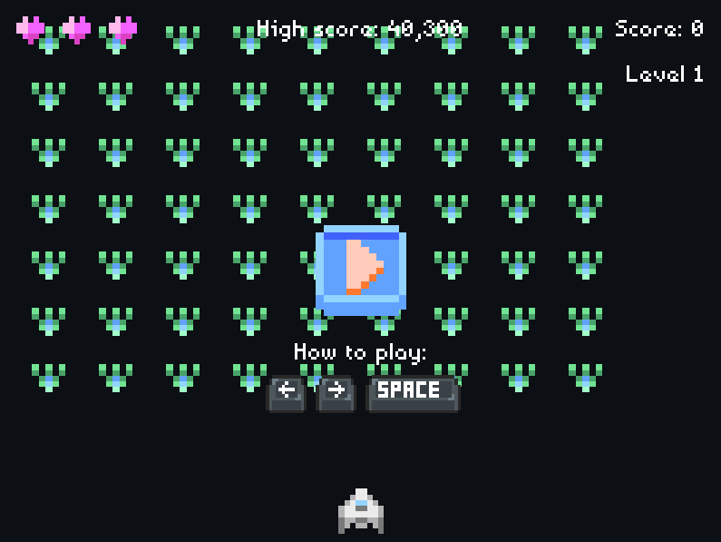

# Space Shooter Game with Pygame

This is a Space Shooter-style game made in Python using the Pygame library. This game is based on a project from the book "Python Crash Course" with a few features and personal look and feel on top of it. Follow these steps to run the game.

## Running the game

1. Download or clone this repository.
2. Open a terminal or console in the directory where you downloaded or cloned the repository.
3. Run the following command to run the game:

```shell
python game.py
```

## Playing the game

The game consists of controlling a space ship and shooting at the enemies that come towards you. You can move the ship to the left and right using the left and right arrow keys on your keyboard, and you can shoot using the spacebar. The objective is to shoot down all the enemies and survive as long as possible.

## Screenshots




Assets by [Gustavo Vituri](https://gvituri.itch.io/space-shooter) and [Dream Mix](https://dreammix.itch.io/keyboard-keys-for-ui). Music by [Tallbeard Studios](https://tallbeard.itch.io/three-red-hearts-prepare-to-dev). Sound FX from Youtube Audio Library.
